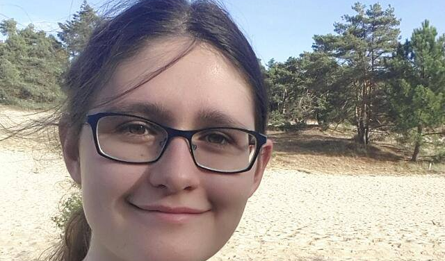

 <link rel="stylesheet" href="/assets/css/bootstrap.min.css"> 

<h2 style="text-align:center">Our Team</h2>

  

    

      
      

        <h2>Merlijn Vermeer</h2>
        
Project Leader

        

        
<a href="mailto:merlijn.vermeer@student.fontys.nl" class="button">Contact</a>

      

    

  

  

    

      
      

        <h2>Marc van Bommel</h2>
        
Security engineer

        

        
<a href="mailto:marc.vanbommel@student.fontys.nl" class="button">Contact</a>

      

    

  

  

    

      
      

        <h2>Rick Theeuwes</h2>
        
Ethical Hacker

        

        
<a href="mailto:r.theeuwes@student.fontys.nl" class="button">Contact</a>

      

    

  

  

    

      
      

        <h2>Thomas van Heel</h2>
        
Ethical Hacker

        

        
<a href="mailto:t.vanheel@student.fontys.nl" class="button">Contact</a>

      

    

  

    

    

      
      

        <h2>Joël Adams</h2>
        
Ethical Hacker

        

        
<a href="mailto:j.adams@student.fontys.nl" class="button">Contact</a>

      

    

  

  

    

      
      

        <h2>Hristo Slavchev</h2>
        
Security engineer

        

        
<a href="mailto:h.slavchev@student.fontys.nl" class="button">Contact</a>

      

    

  

  

    

      
      

        <h2>Anouk Brondijk</h2>
        
Ethical hacker

        

        
<a href="mailto:anouk.brondijk@student.fontys.nl" class="button">Contact</a>

      

    

  

