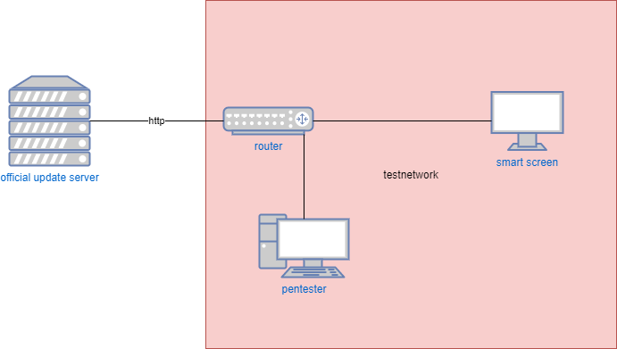
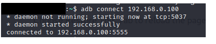
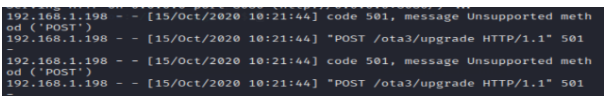

# Smartscreen

Nowadays many companies and individuals use IoT technologies; such as smartphone, smart doorbells or smart screen.
The smartscreen is a system which is popular in many (big) companies, because of the flexibility of those screens. Smartscreens can run their own programs but can also be connected to a laptop to give presentations. Those screens store a lot of (sensitive) data, which means they need to be secure. Besides data attacks on the smartscreens, attackers might also try to get control over the smartscreen to get network access or to use the smartscreen in a botnet.

## Table of Contents

- [Smartscreen](#smartscreen)
  - [Table of Contents](#table-of-contents)
  - [Subject Explanation](#subject-explanation)
  - [Strengths](#strengths)
  - [Vulnerabilities](#vulnerabilities)
  - [Possible Fixes](#possible-fixes)
  - [Best practices](#best-practices)
  - [Bibliography (APA)](#bibliography-apa)
  - [Appendix](#appendix)

## Subject Explanation

 For the pentest, a test network was created and the screen was connected  to the router with an ethernet cable. The pentesters had full network access and control. Physical  access to the smartschreen was also granted to the pentesters.

 {: }

According to the [cyber kill chain](https://www.varonis.com/blog/cyber-kill-chain/) the screens and accorded services were tested. The tools that were used are mostly the same tools we use in Kali Linux for other pentests. Among these are:

- Burp Suite
- Nmap
- CallStranger
- Wireshark

During the pentest, the [research](/research) was kept in mind according to known IoT vulnerabilities.

## Strengths

The security of the tested smart screens was of a high level, most ports refused any connection and several vulnerabilities where already patched. Ports that aren't needed are closed and attack vectors have been minimalized.

## Vulnerabilities

- **Android Debug Bridge**
The initial version of the smart screen we tested had the android debug bridge(ADB) port opened, this means anyone on the network can get a root shell on the smart screen. After an update of the firmware this port was closed.

{: }

- **False firmware update**
Because the update server did not implement HTTPS it is possible to read the communication between the smart screen and the server. This makes it possible to create a fake update server, combine this with a man in the middle attack and it is possible to make the smart screen pull an update from the fake server. This can either corrupt or add malware to the smart screen.

{: }

## Possible Fixes

Both problems can be fixed quite easily. For the ADB vulnerability just make sure no production version has the ADB port open and make sure no one gets the developer version. To secure the server an SSL certificate should be added to the server.

## Best practices

The best practises found in this case are [split development and production](../bestpractices/splitdevprod.md) and [secure data transfer](../bestpractices/securedatatransfer.md) more about these best practices can be read on their respective pages.

## Bibliography (APA)

- the** document for the research of known vulnerabilities %TODO%

## Appendix

Any extra pages about this subject.
