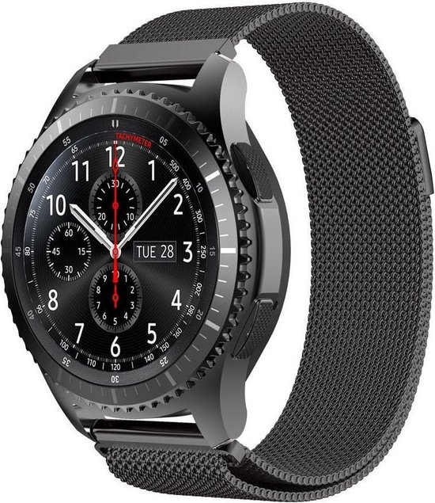
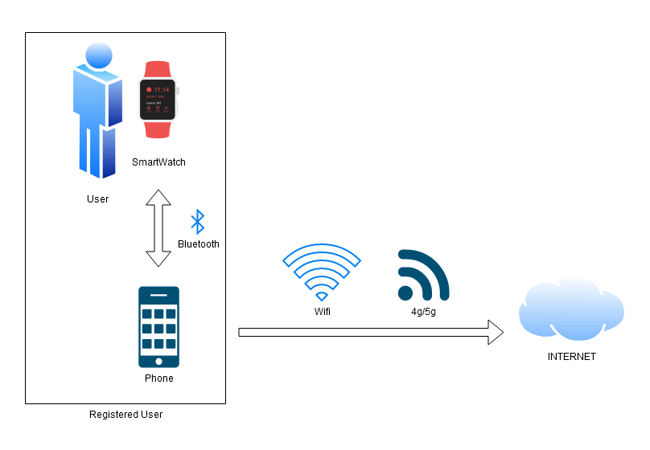

# Smartwatch
Smartwatches are a common item in the average catalog of items a person carries around these days. It has your contact information, can make calls to your friends and even keep track of your steps.
But these watches are not just like any ordinary watch, they can be hacked and used to spy on people.

{: height="300px" width="200px"}

## Table of Contents

- [Subject Explanation](#subject-explanation)
- [Strengths](#bibliography)
- [Vulnerabilities](#vulnerabilities)
- [Best practices](#best-practices)
- [Possible fixes](#possible-fixes)
- [Bibliography](#bibliography)
- [Appendix](#appendix)

## Case Explanation

The Smartwatch case is about the research we've done on the "Samsung Gear S3 frontier" Smartwatch.

We first gathered all the intel we could find on the version the OS was running on, which was Tizen OS 4.0.0.4.
This version of Tizen was outdated and had a exploit allowing users to call interfaces without correct authorization.

The attack we tried was done by first: scanning all the available methods we can call without authorization of every interface from the watch. The program used here would call every method with random 
parameters and log the response get. If the response was "InvalidArgs" instead of "AccesDenied", that meant we could abuse the interface with the out of date OS version.

Then the attacker could write malware that would abuse the open methods from those interfaces to hijack Wifi/Bluetooth/Contact info etc.. (depending on the interface)

## Strengths

The SmartWatch was strong in its strengths, there were no other open attack vectors for us to exploits except the outdated OS it was running.

## Vulnerabilities

**Outdated OS**
The OS was outdated with version 4.0.0.4, this allowed unauthorized access to methods from some interfaces on the watch.

**Unauthorised Acces to Interfaces**
Some interfaces on the watch did not need authorized access to be able to call their methods, therefore the attack could write malware that calls these methods to receive and change information like: contact info, screenshots of the current screen, change the Bluetooth of wifi connection and more, depending on the interface.

## Possible Fixes

To prevent outdated software from being used the user needs to update their Samsung Watch application on their phone, and update their Samsung Smart Watch.

This is relatively easy to implement, by simply checking "the automatic update" feature.

## Best practices

The Smartwatch should be updated when given the chance to as referred to in the [Version-Update best practise page](/bestPractises/versionUpdate).

Always set the automatic update option on the phone smartwatch app to "ON", making sure the user does not have to think about whether he has to update his watch or not. And if the user has one, link the Samsung account to the SmartWatch App on the phone. This way the user can erase their data, or transfer their data to a new watch safely.

## Bibliography
[https://nvd.nist.gov/vuln/detail/CVE-2018-16262](https://nvd.nist.gov/vuln/detail/CVE-2018-16262 )

[https://www.youtube.com/watch?v=3IdgBwbOT-g&feature=youtu.be](https://www.youtube.com/watch?v=3IdgBwbOT-g&feature=youtu.be)

## Appendix 

Any extra pages about this subject.
